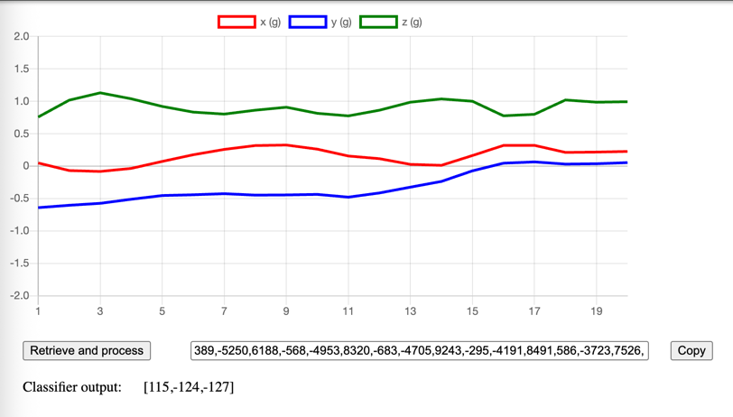

# Assignment 1: Onboard vs. Offboard Data Analytics
 ## Task 1: Preliminaries
### a) Estimated average power consumption
We know that P = U * I

We have the following actions:
- Active BLE
- Accelerometer @ 12.5 Hz
- CPU @ 100% for 5 ms every 1.6 s

From the power consumption table on the website https://www.espruino.com/Puck.js#power-consumption, 
we get the following current values for the given actions:
- Active BLE: 600 µA
- Accelerometer @ 12.5 Hz: 350 µA
- CPU @ 100% for 5 ms every 1.6 s
  - CPU ussage cycle: 0.005 s / 1.6 s = 0.003125
  - Thus, the avverage CPU current is:  4000 µA * 0.003125 =  12.5 µA

Total average current: 600 µA + 350 µA + 12.5 µA  = 962.5 µA ≈ 0.963 mA

The CR2032 has a voltage  3 V.

P = U * I = 0.963 mA * 3.0 V ≈ 2.89 mW

The average power consumption is approximately 2.9 mW (with default BLE connection settings).

### b) Battery Life Estimate
We use the properties of a GP CR2032 battery:
- Voltage: 3.0 V
- Capacity: 220 mAh
- Each classification consumes 2.5 mW over 1.6 s

We calculate the total energy in the battery and the energy consumption per classification, 
we then get te number of possible classification per battery. We know that E = P * t and 1 Joule [J] = 1 Wattsekunde [Ws] = 1 VAs = 1 Nm.

**Battery energy**

Capacity = 220 mAh = 0.22 Ah  
Energy = 0.22 Ah * 3.0 V = 0.66 Wh  
Convert to Joules: 0.66 Wh * 3600 = 2376 J

**Energy per classification**

Power = 2.5 mW = 0.0025 W  
Time = 1.6 s  
Energy per classification = 0.0025 W * 1.6 S = 0.004 J

**Number of classifications**  
Number = 2376 J / 0.004 J ≈ 594'000

A CR2032 can support roughly 594'000 gesture classifications.

### c) Estimating Task Energy
We know that E = P * t and have an indication (digital signal), when the task is running.

You can estimate the task’s energy by multiplying power and time only during the intervals when the digital signal is high. We finally sum up those values across the task duration.

## Task 2: On-Board Data Analysis
### a) Flash Puck.js
I used the firmware provided in Slack.

### b) Program
See [task2_b.js](../src/task2_b.js)

### c) Program with sliding window
See [task2_c.js](../src/task2_c.js)

## Task 3: Off-Board Data Analysis
- Webapp: [offboard_version](../offboard_version)
- Puck.js code: [task3.js](../src/task3.js)
#

## Task 4: Analyze Power Traces
See [postprocessing_measurements.ipynb](../postprocessing_measurements.ipynb)
### a) on-board
- Average power consumption: 2.633 mW 
- Energy consumed during task: 4.516 mJ 
- Average power while active: 11.799 mW 
- Average execution time: 5.24 ms

### b) off-board
- Average power consumption: 2.731 mW
- Energy consumed during task: 56.146 mJ
- Average power while active: 11.846 mW
- Average execution time: 62.36 ms

### c) sleep state
Not done!

## Task 5: Compare and Contrast
Comparing results from task 4.

### Similarities
- Active power during execution is almost identical (~11.8 mW).
- Average overall power is also very similar (~2.6–2.7 mW) (idle time dominates).

### Differences
- Execution takes much longer in the off-board case (62 ms vs. 5 ms).
- Energy per task is ≈12× higher off-board (56 mJ vs. 4.5 mJ), because the task lasts longer.

### Biggest Overhead
- The BLE connection in the off-board version is the largest overhead.
- Same power level as on board execution, but much longer execution time → far more energy consumed.

### Estimated Battery Lifetime (CR2032, 220 mAh, 3.0 V)

- Battery energy (Task 1b):  2376 J

| Version    | Avg. Power | Est. Lifetime |
|------------|------------|----------------|
| On-board   | 2.633 mW   | ~251 h (~10.5 days) |
| Off-board  | 2.731 mW   | ~242 h (~10.1 days) |

### Optimizations
To maximize battery lifetime, we could reduce UART transmissions by batching data, adjust BLE intervals to limit radio activity, or optimize CPU use to avoid unnecessary wake-ups and therefore keeping the device in low-power states as much as possible  → only send / calculate data, if there was movement.

### Conclusions & Trade-offs
The results show that on-board execution is more energy-efficient than the off-board approach, consuming roughly twelve times less energy per task and finishing execution about twelve times faster. Although the average overall power consumption of both approaches is similar because idle time dominates.
But if the task frequency would increase, the gap would widen significantly. 

In conclusion, on-board execution scales much better for long-term, battery-powered operation, since it keeps tasks short, reduces communication overhead, and allows the device to return to low-power states more quickly. The off-board approach, while useful for debugging or development, comes with substantial energy and latency costs, making it less suitable for real-world, energy-constrained deployments.

## Aids Used
- ChatGPT - Help with coding
